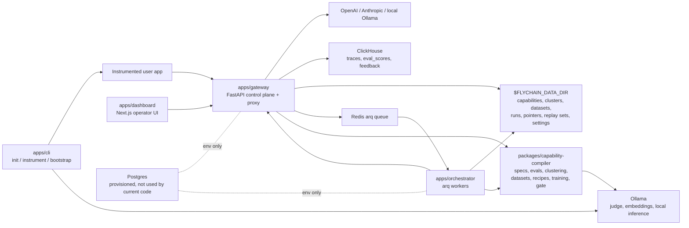
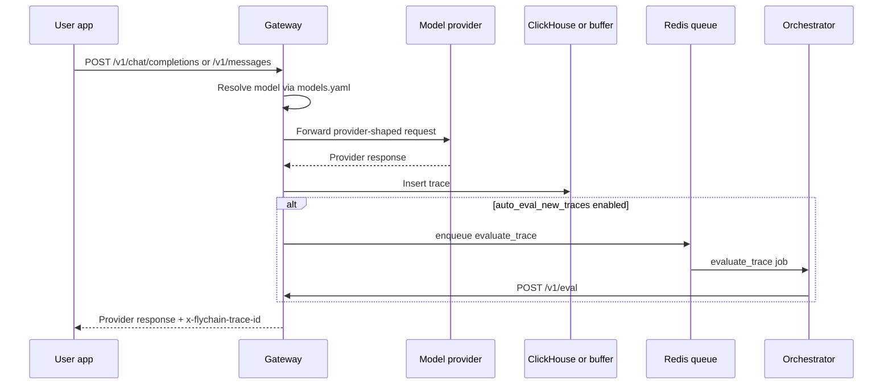

# FlyChain

FlyChain is an open-source, Apache-2.0, local-first flywheel for improving
models on named capabilities. It captures real LLM traffic, evaluates each
trace against capability-specific rubrics, groups repeated failures, turns
those failures into SFT or DPO datasets, queues training runs, and promotes
adapters only after measured comparison and gating.

This README documents the system that exists in this repository today. Future
product direction lives in [docs/architecture/roadmap.md](./docs/architecture/roadmap.md).

## Current Status

The current implementation is a mixed Python and TypeScript monorepo with:

- A FastAPI gateway that proxies OpenAI-compatible chat completions,
  Anthropic messages, and local Ollama models.
- ClickHouse-backed trace, eval score, and feedback persistence with an
  in-memory fallback when ClickHouse is unavailable.
- File-backed local state under `$FLYCHAIN_DATA_DIR` for capabilities,
  clusters, datasets, training runs, replay sets, adapter pointers, and local
  runtime settings.
- A Next.js dashboard for capability creation, scorecards, trace exploration,
  clustering, dataset synthesis, training run control, replay sets, A/B
  comparison, gating, and adapter activation.
- An arq/Redis orchestrator for background eval, training, and promotion gate
  jobs.
- A capability compiler package that owns `CapabilitySpec`, template loading,
  LLM-as-judge eval, failure clustering, dataset synthesis, recipe loading,
  training backend selection, and promotion gate logic.
- A Node CLI for project initialization, source instrumentation previews, and
  local Ollama model bootstrapping.
- Thin Python and TypeScript SDK helpers. The SDKs are currently config helpers,
  not full gateway clients.

Postgres is included in `docker-compose.yml` and exposed through environment
settings, but current application code does not write metadata to Postgres yet.

## Documentation Map

Start here, then use the deep dives when you need implementation-level detail:

- [Architecture index](./docs/architecture/README.md)
- [System overview](./docs/architecture/system-overview.md)
- [Gateway deep dive](./docs/architecture/gateway.md)
- [Capability flywheel](./docs/architecture/capability-flywheel.md)
- [Dashboard, CLI, and SDKs](./docs/architecture/dashboard-cli-sdks.md)
- [Persistence and config](./docs/architecture/persistence-and-config.md)
- [Roadmap and future architecture](./docs/architecture/roadmap.md)
- [Historical product plan](./plan.md)
- [Contributing guide](./CONTRIBUTING.md)

## Architecture At A Glance



The gateway is the center of the current system. It receives dashboard and
instrumented-application requests, owns API validation and routing, persists
observability records, calls compiler/flywheel primitives, and enqueues
background work. The orchestrator is deliberately thin: it consumes Redis jobs
and delegates core behavior back to the gateway or compiler package.

## Primary Runtime Flows

### 1. Proxy, Trace, And Optional Auto-Eval



Key details:

- OpenAI-compatible models use `POST /v1/chat/completions`.
- Anthropic models use `POST /v1/messages`.
- Streaming is rejected with a clear `400` response in current code.
- `x-flychain-project`, `x-flychain-capabilities`, and `x-flychain-tags`
  headers provide trace metadata.
- OpenTelemetry spans are created for proxy calls. An OTLP exporter is attached
  only when `FLYCHAIN_OTLP_ENDPOINT` is set.

### 2. Capability Creation

Capabilities can be created from shipped YAML templates or from plain-language
descriptions:

1. Dashboard calls `GET /v1/capabilities/templates` for recommended templates.
2. `POST /v1/capabilities/from-template` copies a template into
   `$FLYCHAIN_DATA_DIR/capabilities/<id>.yaml`.
3. Describe mode calls `POST /v1/capabilities/compiler/questions`, then
   `POST /v1/capabilities/compiler/compile`.
4. The user reviews the compiled JSON and persists it with
   `POST /v1/capabilities`.

The canonical schema is `CapabilitySpec` in
`packages/capability-compiler/src/flychain_capability_compiler/schema.py`.

### 3. Eval, Scorecards, And Failures

`POST /v1/eval` receives trace text and evaluates it against explicit
capability IDs or every persisted capability. The `EvalEngine` checks slice
rules, renders judge prompt templates, calls the configured judge LLM, parses
strict JSON verdicts, and writes per-dimension scores.

Scorecards are computed from stored eval scores by
`GET /v1/capabilities/{capability_id}/scorecard`. Failures are derived by
joining traces, eval scores, and latest feedback in
`GET /v1/capabilities/{capability_id}/failures`.

### 4. Clustering And Dataset Synthesis

Failure clustering is request-driven today:

1. Pick failing trace IDs or send failures inline.
2. Call `POST /v1/capabilities/{id}/cluster-run`.
3. The gateway embeds failure signatures with the configured embedder, clusters
   them with HDBSCAN, optionally labels clusters with the judge model, and
   stores the result in `$FLYCHAIN_DATA_DIR/clusters/<capability_id>.json`.
4. Call `POST /v1/capabilities/{id}/synthesize-dataset` with a cluster or
   cluster ID.
5. The gateway writes SFT or DPO JSONL rows under
   `$FLYCHAIN_DATA_DIR/datasets/<capability_id>/<dataset_id>.jsonl` and records
   the dataset in `$FLYCHAIN_DATA_DIR/datasets/index.json`.

Feedback `corrected_response` values are the preferred gold signal. If
`generate_missing` is enabled, the judge/LLM can generate ideal responses for
missing corrections.

### 5. Training, A/B Compare, Gate, And Adapter Pointer

```mermaid
flowchart LR
    Dataset["Synthesized dataset"] --> Run["POST /v1/training-runs\nrun status: queued"]
    Run --> Redis["Redis: run_training_recipe"]
    Redis --> Worker["orchestrator worker"]
    Worker --> Backend["dry-run / mlx-lm / unsloth"]
    Backend --> Artifact["run artifact under\n$FLYCHAIN_DATA_DIR/runs"]
    Artifact --> Compare["POST /v1/capabilities/{id}/ab-compare"]
    Compare --> Gate["POST /v1/training-runs/{run_id}/apply-gate"]
    Gate --> Pointer["pointers/<capability_id>.json\nactive adapter"]
```



Training runs are persisted as JSON under `$FLYCHAIN_DATA_DIR/runs`. Backends
come from recipe YAML:

- `dry-run` is always available and produces a fake adapter artifact for local
  and CI-safe flows.
- `mlx-lm` runs on Darwin hosts with `mlx_lm` installed.
- `unsloth` runs on Linux CUDA hosts with `nvidia-smi` and `unsloth`.

If a requested backend is unavailable and the run allows fallback, backend
selection falls back to `dry-run`.

The promotion gate compares baseline and candidate aggregate scores. It
promotes only when the target capability beats the configured threshold and no
other capability regresses beyond tolerance. Promotion writes the active adapter
pointer for that capability.

## Repo Layout

```text
apps/
  gateway/          FastAPI gateway, provider proxy, trace/eval/feedback APIs,
                    local stores, queue handoff
  orchestrator/     arq worker process for eval, training, and gate jobs
  dashboard/        Next.js App Router operator dashboard
  cli/              Node CLI for init, instrumentation, local model bootstrap
packages/
  capability-compiler/
                    CapabilitySpec schema, compiler, eval engine, clustering,
                    dataset synthesis, recipes, training backends, gate
  sdk-py/           Python SDK config helper
  sdk-ts/           TypeScript SDK config helper
capabilities/
  templates/        Shipped capability templates
evals/
  judge-prompts/    Markdown LLM-as-judge templates
recipes/            SFT and DPO LoRA recipe YAML
infra/
  clickhouse/init/  ClickHouse schema
docs/
  architecture/     Architecture and subsystem documentation
```

## Service Entrypoints

- Gateway app: `apps/gateway/src/flychain_gateway/main.py`
- Gateway schemas: `apps/gateway/src/flychain_gateway/schemas.py`
- Provider routing: `apps/gateway/src/flychain_gateway/providers/registry.py`
- Trace store: `apps/gateway/src/flychain_gateway/trace_store.py`
- File-backed stores: `apps/gateway/src/flychain_gateway/*_store.py`
- Orchestrator worker: `apps/orchestrator/src/flychain_orchestrator/worker.py`
- Dashboard gateway client: `apps/dashboard/src/lib/gateway.ts`
- Dashboard pages: `apps/dashboard/src/app/`
- CLI entrypoint: `apps/cli/src/index.ts`
- Capability compiler package:
  `packages/capability-compiler/src/flychain_capability_compiler/`

## Local Development

Prerequisites:

- Docker Desktop or compatible Docker Compose runtime
- Node.js 20+
- pnpm 9+
- Python 3.11+
- uv

Install dependencies:

```bash
pnpm install
uv sync
```

Run the local stack:

```bash
docker compose up -d
```

Pull the local judge and embedding models into the Ollama container:

```bash
pnpm -F @flychain/cli build
node ./apps/cli/dist/index.js bootstrap local-models
```

Open the dashboard:

```bash
open http://localhost:3000
```

Useful dev commands:

```bash
make install        # pnpm install + uv sync
make dev            # docker compose up -d
make down           # docker compose down
make logs           # docker compose logs -f --tail=200
make lint           # JS package lint + ruff check
make typecheck      # TS typecheck
make test           # JS package tests + pytest
make fmt            # prettier write + ruff format
```

Run services without Docker when needed:

```bash
uv run uvicorn flychain_gateway.main:app --reload --host 0.0.0.0 --port 8080
uv run arq flychain_orchestrator.worker.WorkerSettings
pnpm -F @flychain/dashboard dev
```

## Configuration

Most runtime config is environment-driven through the `FLYCHAIN_` prefix.
Copy `.env.example` to `.env` for local overrides.

Important variables:

- `FLYCHAIN_DATA_DIR`: shared local state root. Docker Compose mounts
  `./.flychain-data` as `/data`.
- `FLYCHAIN_CLICKHOUSE_URL`: trace/eval/feedback store URL.
- `FLYCHAIN_REDIS_URL`: arq queue URL.
- `FLYCHAIN_OLLAMA_URL`: local model server URL.
- `FLYCHAIN_GATEWAY_URL`: dashboard/orchestrator gateway URL.
- `FLYCHAIN_JUDGE_MODEL`: default judge model.
- `FLYCHAIN_EMBEDDING_MODEL`: default embedding model.
- `FLYCHAIN_MODELS_YAML`, `FLYCHAIN_TEMPLATES_DIR`, `FLYCHAIN_RECIPES_DIR`:
  override packaged model registry, templates, or recipes.
- `OPENAI_API_KEY`, `ANTHROPIC_API_KEY`: optional cloud provider and judge
  keys.

The dashboard settings page edits non-secret local runtime knobs in
`$FLYCHAIN_DATA_DIR/settings.json`. Secrets stay in environment variables.

## Testing And CI

Repository checks:

```bash
pnpm format:check
pnpm -r --if-present typecheck
pnpm -r --if-present test
uv run ruff check .
uv run ruff format --check .
uv run pytest
```

GitHub Actions runs Python lint/format/tests, Node formatting/typecheck/builds,
Node tests, and Docker image builds for gateway, orchestrator, and dashboard.

## Current Limitations

- SDKs are config helpers, not full client libraries.
- Gateway streaming is not implemented; streaming requests return `400`.
- Postgres is provisioned but unused by current code.
- Automatic periodic clustering is not implemented; clustering is triggered by
  API/dashboard action.
- Active adapter pointers are persisted, but provider routing currently does
  not dynamically load adapters into Ollama or another serving backend.
- Cloud training backends exist in recipe enum shape only; implemented runtime
  backends are dry-run, MLX-LM, and unsloth.

## License

Apache-2.0. See [LICENSE](./LICENSE).

## Contributing

See [CONTRIBUTING.md](./CONTRIBUTING.md).
