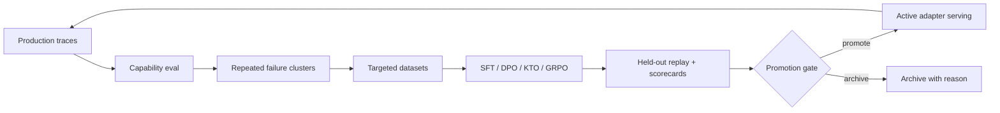

# Roadmap And Future Architecture

This document describes intended direction, not current implementation. For the
implemented system, start with [system overview](./system-overview.md).

## Product Direction

FlyChain is intended to become a complete capability-improvement loop:



The promise is not that every training run improves the model. The promise is
that every run is measured and only better versions ship.

## Current Versus Future

| Area        | Current implementation                               | Future direction                                                  |
| ----------- | ---------------------------------------------------- | ----------------------------------------------------------------- |
| Deployment  | Local Docker Compose                                 | Helm, Terraform, hosted control plane                             |
| Trace store | Single-node ClickHouse with fallback buffer          | Scaled ClickHouse plus cold archive                               |
| Metadata    | Local JSON/YAML/JSONL files                          | Postgres-backed metadata and migrations                           |
| Queue       | Redis/arq                                            | Same locally, possible managed queues in hosted mode              |
| Eval judge  | Local Ollama or optional cloud key via `auto_client` | Per-project judge config, multi-judge consensus                   |
| Embeddings  | Ollama or hash fallback                              | Hosted embedding providers and cached vectors                     |
| Clustering  | API-triggered HDBSCAN                                | Scheduled clustering and threshold-triggered dataset creation     |
| Training    | dry-run, MLX-LM, unsloth                             | Axolotl on Modal, SageMaker, Together, other managed GPU backends |
| Serving     | Adapter pointer persistence                          | Runtime adapter loading, canary, rollback                         |
| SDKs        | Config helpers                                       | Full clients for proxy, feedback, trace, and control-plane APIs   |
| Dashboard   | Local operator workspace                             | Multi-project, multi-user, hosted UI                              |

## Near-Term Engineering Priorities

1. Split gateway route groups into smaller modules without changing public API.
2. Align CLI-injected tag headers with gateway tag parsing.
3. Wire scheduled or threshold-triggered clustering using existing local
   settings.
4. Persist failure embeddings or explicitly remove the unused table until it is
   needed.
5. Implement dynamic active adapter serving for local Ollama or another local
   serving path.
6. Move metadata from local files to Postgres once concurrent operation or
   multi-user workflows require it.
7. Expand SDKs into real gateway clients.

## Capability Library Expansion

Candidate future templates:

- Citation fidelity.
- Tool-use correctness.
- Debugging correctness.
- Retrieval ranking quality.
- Safety policy adherence.
- Structured extraction fidelity.

Each template should remain a normal `CapabilitySpec` YAML file with judge
prompt refs and recipe refs.

## Training Backend Expansion

Schema already names more backends than are implemented. Future backend work
should preserve the `TrainingBackend` protocol shape:

```python
artifact = backend.run(
    recipe=recipe,
    dataset_path=dataset_path,
    output_dir=output_dir,
)
```

Additional backends should return the same `TrainingArtifact` shape so gateway,
orchestrator, dashboard, and adapter pointers do not need backend-specific
logic.

## Hosted Or BYO-Cloud Shape

A larger deployment would likely separate:

- Public gateway/inference ingress.
- Control-plane API.
- Worker pools for eval, clustering, training, and gate jobs.
- Shared metadata database.
- ClickHouse trace/event warehouse.
- Object storage for datasets, artifacts, logs, and archives.
- Model serving fleet.

The local-first abstractions are intentionally close to that shape: route calls,
queue jobs, file-backed state, and recipe-driven backends can move to service
boundaries later.

## Deferred Product Features

- Multi-tenant auth, billing, and project management.
- Hosted template and recipe hub.
- Online canary and traffic splitting.
- Automatic rollback from live metrics.
- GRPO reward functions compiled from capability dimensions.
- Large-scale dataset review workflows.
- Managed cloud training and artifact registry.

These should stay out of the current-system README until implemented.
