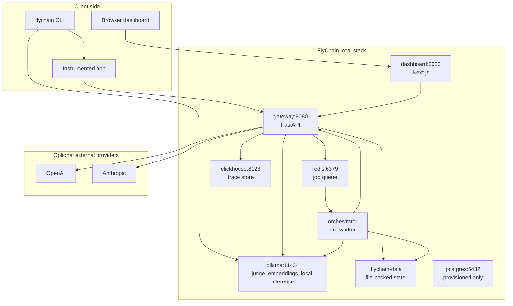

# System Overview

FlyChain is built as a local-first control plane around LLM traffic. The code
is split into small apps and packages, but the runtime center is the gateway.
The gateway accepts operator and application traffic, persists observability
records, delegates capability logic to the compiler package, and queues
background jobs for the orchestrator.

## Runtime Topology

## Component Ownership

| Component           | Path                                 | Responsibility                                                                                                                                                                         |
| ------------------- | ------------------------------------ | -------------------------------------------------------------------------------------------------------------------------------------------------------------------------------------- |
| Gateway             | `apps/gateway`                       | API server, provider proxy, trace writes, feedback, capability CRUD, eval execution, cluster/dataset actions, training queue, replay sets, A/B comparison, active adapter pointer APIs |
| Orchestrator        | `apps/orchestrator`                  | Redis-backed background jobs for eval handoff, training execution, and promotion gate application                                                                                      |
| Dashboard           | `apps/dashboard`                     | Operator UI for capabilities, traces, settings, triage, datasets, training runs, replay sets, comparisons, and adapter pointer control                                                 |
| CLI                 | `apps/cli`                           | Project config creation, source instrumentation preview/apply, local Ollama bootstrap                                                                                                  |
| Capability compiler | `packages/capability-compiler`       | Shared domain package for specs, compiler, eval, clustering, dataset synthesis, recipes, training backends, and gate logic                                                             |
| SDKs                | `packages/sdk-py`, `packages/sdk-ts` | Thin config helpers only                                                                                                                                                               |
| Templates           | `capabilities/templates`             | Shipped YAML `CapabilitySpec` templates                                                                                                                                                |
| Recipes             | `recipes`                            | Shipped YAML training recipes                                                                                                                                                          |
| Judge prompts       | `evals/judge-prompts`                | Markdown templates used by LLM-as-judge eval dimensions                                                                                                                                |
| Infra               | `infra/clickhouse/init`              | ClickHouse schema                                                                                                                                                                      |

## Control Plane Boundaries

The gateway has the broadest responsibility today. This is intentional in the
current local-first implementation: the dashboard can talk to one service, and
the orchestrator can stay small.

The compiler package is the domain boundary. It has no FastAPI routes and no
dashboard concerns. It owns the reusable capability primitives that the gateway
and orchestrator call.

The orchestrator does not duplicate gateway eval logic. Its `evaluate_trace`
job calls the gateway's `/v1/eval` endpoint through
`flychain_orchestrator.eval_client.post_eval`. Training and gate jobs run
locally against file-backed state because run artifacts and adapter pointers
are local filesystem objects.

## Local State Model

FlyChain uses two persistence styles:

- ClickHouse stores high-volume event-like records: traces, eval scores,
  feedback, and a table reserved for failure embeddings.
- `$FLYCHAIN_DATA_DIR` stores local control-plane state as YAML/JSON/JSONL:
  capabilities, clusters, datasets, runs, adapter pointers, replay sets, and
  non-secret settings.

Docker Compose bind-mounts `./.flychain-data` into gateway and orchestrator as
`/data`. That shared mount is what lets the gateway create datasets and the
orchestrator consume them during training.

## Main Lifecycles

### Trace Capture

1. A user app calls the FlyChain gateway instead of calling the provider
   directly.
2. Gateway resolves `body.model` through `models.yaml`.
3. Gateway forwards the provider-shaped request.
4. Gateway records a `TraceRecord` with request, response, tokens, cost,
   latency, status, error, project ID, and tags.
5. Gateway returns the provider response and an `x-flychain-trace-id` header.

### Feedback Capture

1. Client calls `POST /v1/feedback` with `trace_id`, score/thumb/comment, and
   optionally `corrected_response`.
2. Gateway writes feedback to ClickHouse or the in-memory fallback.
3. Later failure derivation uses the latest feedback per trace, especially
   `corrected_response`, as gold data for SFT or DPO rows.

### Capability Setup

1. Operator creates a capability from a shipped template or compiler output.
2. Gateway persists it as YAML under `capabilities/<id>.yaml` in the data dir.
3. Eval, scorecard, failure, clustering, dataset, replay, and adapter APIs use
   that persisted spec.

### Eval And Scorecard

1. Gateway receives explicit `POST /v1/eval`, or an auto-eval setting causes a
   proxy request to enqueue `evaluate_trace`.
2. Eval engine filters capabilities by slice rules.
3. Each eval dimension renders a judge prompt and calls the configured LLM.
4. Scores are persisted and later aggregated into scorecards.

### Failure To Dataset

1. Gateway derives failures from eval scores that did not pass.
2. Clustering embeds each failure signature and groups failures with HDBSCAN.
3. Dataset synthesis creates SFT or DPO JSONL rows from cluster traces.
4. Dataset records are indexed so training runs can resolve `dataset_id` to a
   path.

### Dataset To Adapter Pointer

1. Gateway creates a queued `TrainingRun` and enqueues `run_training_recipe`.
2. Orchestrator selects a backend from the recipe, with optional dry-run
   fallback.
3. Backend writes artifacts under the run directory.
4. Operator can run A/B comparison from replay rows.
5. Gateway can queue `apply_promotion_gate` using explicit scores or the latest
   comparison.
6. If the gate promotes, orchestrator writes the active adapter pointer.

## Extension Points

- Add provider models by editing `models.yaml` or setting `FLYCHAIN_MODELS_YAML`.
- Add capability templates by adding YAML files matching `CapabilitySpec`.
- Add judge prompts by adding Markdown templates and referencing them from eval
  dimensions.
- Add recipes by adding YAML files matching `Recipe`.
- Add training backends by implementing the `TrainingBackend` protocol and
  registering it in `training.py`.
- Add dashboard controls by extending `apps/dashboard/src/lib/gateway.ts` and
  the relevant App Router page or client component.

## Current Design Tradeoffs

- Gateway concentration keeps the local stack simple but makes
  `main.py` a large file. New route groups should follow existing behavior but
  consider extracting helpers when adding substantial new surfaces.
- File-backed state is transparent and easy to inspect, but it is not designed
  for concurrent multi-user mutation.
- ClickHouse fallback buffers are useful for tests and laptop work, but they
  are process-local and not durable.
- Postgres is ready in Compose but not integrated with current stores.
