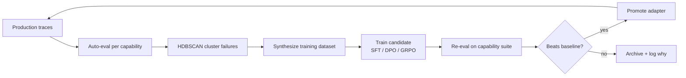

# FlyChain: Product Requirements & Full-Scope Plan

> **FlyChain is an open-source (Apache-2.0) flywheel for making models better at specific capabilities.**
> It collects real traces, automatically evaluates them, clusters repeated failure modes, turns those failures into targeted training data, trains new model variants with SFT / DPO / GRPO, and only promotes versions that measurably improve on the chosen capability.

This document is the canonical PRD and phased roadmap for the entire FlyChain product, from the local-only v1 through the hosted v2 control plane. It supersedes all earlier drafts.

---

## 1. Product Requirements Document

### 1.1 Elevator Pitch

FlyChain is an open-source platform that turns production LLM traffic into targeted weight updates on a model. Users pick (or describe) a capability they care about, FlyChain auto-evaluates every trace against that capability, clusters failures, synthesizes targeted training data from the clusters, and fine-tunes a new adapter. Only adapters that measurably beat baseline on the chosen capability are promoted.

### 1.2 Who It's For

- **Academics and students** running experiments on model capabilities.
- **Independent builders** shipping AI-powered apps who want their models to get better at the specific thing their app does.
- **Capability-focused engineers** at labs and startups who want a reproducible, weight-update-centric loop instead of a prompt-engineering treadmill.

FlyChain is explicitly not a business-workflow optimization platform. It is a capability-improvement platform.

### 1.3 Core Value Propositions

1. **Capability-centric.** Every object in the system - evals, datasets, recipes, promotion gates - is scoped to a named capability, not to a generic "quality" score.
2. **Natural-language-first goal selection.** Users describe what they want the model to get better at; a Capability Spec Compiler turns that into a structured, auditable `CapabilitySpec`. A curated "recommended" mode is available for users who want expert defaults.
3. **Fully automated improvement loop.** Traces -> auto-eval -> failure clusters -> synthesized training datasets -> candidate fine-tunes -> gated promotion. No manual failure reporting required.
4. **Weight updates are the center of gravity.** Prompt edits and routing tweaks are available but demoted. Repeated failure clusters preferentially become SFT / DPO / GRPO training data.
5. **Only better versions ship.** The promise is not "every run improves" but "every run is measured, and only better versions ship," enforced by an auto-promote gate.
6. **Local-first, not local-only.** A 16 GB MacBook runs the entire v1 loop with 1B-3B models and local LoRA training. Cloud backends are available for larger models and faster iteration when the laptop becomes the bottleneck.
7. **Open-source, Apache-2.0.** Everything - gateway, orchestrator, recipes, capability templates, dashboard - is open and forkable.

### 1.4 Core Concept: The `Capability` Object

A `Capability` is a first-class, named entity. It has:

- **NL description** - "model should follow the exact JSON schema given in the system prompt."
- **Eval dimensions** - structured checks compiled from the NL description (for example `schema_valid`, `all_required_fields`, `no_extra_fields`).
- **Dataset slice rules** - which traces are in-scope: tag filters, regex, semantic filters.
- **Target metric(s) + baseline** - measured on the current model before any training.
- **Recipe links** - eligible training recipes; defaults proposed automatically.
- **Promotion gate** - delta threshold vs baseline required for an adapter to ship.

The flywheel runs **per capability**. A project can track many capabilities in parallel; each has its own baseline, failure clusters, synthesized datasets, and candidate adapters.

### 1.5 The Automated Loop



### 1.6 Target Architecture (full product)

| Layer | v1 (local-only) | Full product |
|---|---|---|
| Gateway | FastAPI, OpenAI/Anthropic-compatible, OTel + OpenInference spans | Same, plus rate-limit and quota controls |
| Trace store | ClickHouse (single-node docker) + Postgres metadata | ClickHouse cluster, S3 cold archive |
| Inference | Ollama (local, 1-3B models + adapters) | Ollama + vLLM + hosted endpoints (Together, Fireworks, Modal) |
| Eval judge | Local Ollama (default `llama3.2:3b-instruct`); optional cloud judge | Configurable per project; multi-judge consensus |
| Embeddings | Local (`nomic-embed-text` / MiniLM) | Local or hosted (Voyage, OpenAI, Cohere) |
| Clustering | HDBSCAN over local embeddings | Same; scales to large trace corpora |
| Training | **MLX-LM LoRA** on Apple Silicon / **unsloth** on CUDA | Plus Axolotl-on-Modal, SageMaker, Together, third-party managed adapters |
| Serving | Merged LoRA -> GGUF -> Ollama / MLX | Plus vLLM clusters, canary with auto-rollback |
| Frontend | Next.js 14 App Router, Tailwind, shadcn/ui | Same, plus multi-tenant UI in v2 |
| CLI | `flychain instrument` (Node, AST + agent) | Same, plus remote project management |
| Deploy target | `docker-compose` | Plus Helm chart and Terraform module (BYO-cloud) and v2 hosted SaaS |

### 1.7 Capability Spec Compiler (front-door UX)

Selection is natural-language-first. Two modes, switchable at any time:

1. **Describe mode.** User types a free-text goal. An interview agent asks 3-6 clarifying questions (what counts as success, failure examples, datasets available, latency budget). Output is an editable `CapabilitySpec`.
2. **Recommended mode.** User picks from the shipped capability template library. The system fills sensible eval dimensions, slice rules, and recipes based on the project's trace shape.

Both modes compile to the same `CapabilitySpec` (YAML/JSON, JSON-schema-validated). The compiler is an LLM pipeline; it runs against the local judge model by default and can fall back to a cloud model if the user provides keys.

### 1.8 Capability Template Library

**v1 ships 5 templates:**

- `groundedness` - answers must be supported by provided context.
- `instruction-following` - outputs must match explicit user constraints (format, schema, length, language).
- `code-correctness` - generated code must parse, type-check, and pass provided tests.
- `uncertainty-calibration` - expressed confidence must track actual accuracy.
- `multi-step-reasoning` - chain-of-thought steps must be internally consistent and lead to the stated conclusion.

**v1.1 adds:**

- `citation-fidelity` - citations reference real, relevant source spans.
- `tool-use-correctness` - tool calls have valid arguments and appropriate timing.
- `debugging` - fixes address the stated root cause without regressions.

Anyone can author and share additional templates via forkable YAML in `capabilities/templates/`.

### 1.9 Recipes

A `Recipe` is a YAML file describing how to turn a dataset into a candidate adapter:

```yaml
base_model: meta-llama/Llama-3.2-3B-Instruct
method: sft                  # sft | dpo | kto | grpo
dataset_ref: cluster-12-sft.jsonl
backend: mlx-lm              # mlx-lm | unsloth | axolotl-modal | sagemaker | together
hyperparams:
  lora_r: 8
  lora_alpha: 16
  lr: 2e-4
  epochs: 3
eval_suite_ref: groundedness.yaml
promotion_threshold: 0.05
```

Recipes live in a public `recipes/` directory and are forkable. The orchestrator auto-selects a backend based on the host (Apple Silicon -> `mlx-lm`, CUDA Linux -> `unsloth`, remote cluster -> `axolotl-modal` / `sagemaker` / `together`) unless the recipe overrides.

### 1.10 Promotion Gate

An adapter is **only** promoted if:

1. It beats the current baseline on the target capability by at least `promotion_threshold`.
2. It causes **no regression** beyond tolerance on any other tracked capability in the project.
3. It passes the configured error-rate and latency sanity checks.

Otherwise the adapter is archived along with the eval diff so a human can inspect.

### 1.11 Feedback Signal (`/v1/feedback`)

The gateway exposes `/v1/feedback` from day one. Payload supports thumbs, numeric score, free-text comment, and - most importantly - `corrected_response`, the gold signal that feeds SFT and DPO dataset synthesis.

### 1.12 Compute Model

- **Local-first.** A 16 GB MacBook (or a single CUDA Linux box) runs the entire v1 loop. Laptop dev is a first-class, supported mode - not a demo shortcut.
- **Not local-only.** As model size or data volume grows, any stage (eval, clustering, training, serving) can be offloaded to a pluggable backend. The recipe and orchestrator abstractions are designed so swapping a local MLX trainer for a remote Modal trainer is a config change, not a rewrite.
- **BYO-cloud.** Post-v1, FlyChain ships a Helm chart and Terraform module so it can run entirely inside a customer VPC with no data leaving their network.

---

## 2. Manual Prerequisites

> The AI coding agent cannot perform these steps. Complete these before executing Phase 0.

### 2.1 Local Dev (v1)

1. **macOS with Apple Silicon (M1+)** or **Linux with CUDA 12+**, 16 GB RAM minimum.
2. **Docker Desktop** (or equivalent) for `docker-compose`.
3. **Node.js 20+**, **pnpm**, **Python 3.11+**.
4. **Ollama** installed and running (Docker image is included in `docker-compose.yml` for convenience).

### 2.2 Optional Keys (all optional for v1)

1. **OpenAI or Anthropic API key** - only needed if the user wants a stronger cloud judge instead of the local Ollama judge. FlyChain works end-to-end without either.
2. **HuggingFace token** - only needed to download gated base models.

### 2.3 Cloud Prerequisites (for v1.3+ and beyond)

These apply only when the user opts into a cloud backend:

1. AWS / GCP / Azure account with appropriate GPU quota for the chosen backend.
2. Terraform >=1.6 or Helm 3 for BYO-cloud deploys.
3. Provider-specific credentials for Modal, Together, SageMaker, etc.

---

## 3. Full-Scope Roadmap

### 3.1 V1 Scope (Local-Only, Apache-2.0)

**Locked constraints:**

- License: Apache-2.0.
- Deployment: OSS, self-hosted, local-only on a 16 GB MacBook. No cloud in the critical path.
- Model size: 1B-3B base models.
- Training backend default: MLX-LM LoRA (Apple Silicon) / unsloth (CUDA). No hosted training in v1 default path.
- Capability templates: 5 (groundedness, instruction following, code correctness, uncertainty calibration, multi-step reasoning).

### 3.2 Phase-by-Phase (V1)

#### Phase 0 - Repo + Laptop Dev Loop
- Monorepo (`pnpm` workspaces): `apps/gateway`, `apps/dashboard`, `apps/cli`, `apps/orchestrator`, `packages/sdk-py`, `packages/sdk-ts`, `packages/capability-compiler`, `recipes/`, `capabilities/templates/`, `evals/`.
- `docker-compose.yml` brings up gateway + ClickHouse + Postgres + dashboard + orchestrator + Ollama locally.
- Apache-2.0 `LICENSE`, `README.md`, `CONTRIBUTING.md`.
- GitHub Actions: lint + unit tests + Docker image publish.

#### Phase 1 - Gateway, OTel, ClickHouse
- OpenAI- and Anthropic-compatible proxy endpoints from day one; extra `local-ollama` provider points at the containerized Ollama.
- Emit OTel spans with `openinference.*` attributes alongside writes to ClickHouse.
- `models.yaml` drives cost calculation and provider routing - users add new providers without code changes.
- `/v1/feedback` endpoint supports thumbs, score, and `corrected_response`.

#### Phase 2 - CLI Instrumentation (`flychain instrument`)
- Node CLI detects Python/TS, finds LLM client constructors via AST, patches them or hands a structured prompt to a local coding agent.
- `flychain init` writes `flychain.config.ts` with project ID and tags.
- Posts a "first trace received" event to the dashboard so onboarding is visible.

#### Phase 3 - Capability Spec Compiler + Dashboard Capability Workspace
- `packages/capability-compiler` implements the NL -> `CapabilitySpec` pipeline with a 3-6 question interview, backed by the local Ollama judge.
- Ship the 5 v1 templates in `capabilities/templates/`.
- Dashboard pages:
  - **Home** - per-capability scorecards (baseline, current, trend).
  - **Capability page** - eval dimensions, slice rules, linked clusters, candidate adapters, recipe suggestions.
  - **Trace explorer** - filter by capability.
  - **Settings** - API keys, provider config, judge model selection.

#### Phase 4 - Auto-Eval Engine
- `arq` worker consumes new traces; runs the eval suite for every capability the trace is in-scope for.
- Eval suite = ordered DeepEval checks compiled from capability eval dimensions; judge templates live in `evals/judge-prompts/`.
- Judge model: local Ollama by default (`llama3.2:3b-instruct`); configurable.
- Writes per-capability scores to ClickHouse; updates dashboard scorecards in real time.

#### Phase 5 - Failure Clustering + Auto-Dataset Synthesis
- Embed failed traces per capability via the local embedding model; store vectors in ClickHouse.
- Hourly HDBSCAN per capability (laptop-sized N). Label each cluster via a one-shot local LLM summarizer.
- **Auto-dataset synthesis** when a cluster crosses a size threshold:
  - SFT - `(prompt, ideal_response)` pairs, where `ideal_response` comes from `/v1/feedback` corrections or a capability-specific rubric generated by the judge.
  - DPO - `(prompt, chosen, rejected)` triples from feedback pairs or judge ratings.
- Dashboard **Triage** tab: cluster -> suggested dataset -> suggested recipe, with one-click "queue candidate run" and an auto-run toggle.

#### Phase 6 - SFT LoRA Recipe + Auto-Promote Gate
- `Recipe` YAML schema (see section 1.9) and orchestrator runner.
- **MLX-LM backend** primary (Apple Silicon): wraps `mlx_lm.lora`; outputs merged weights + GGUF for Ollama serving.
- **unsloth backend** (CUDA Linux alt): wraps unsloth's `FastLanguageModel` LoRA trainer; same output shape.
- Orchestrator auto-selects backend from host detection; recipe can override.
- **Auto-promote gate** enforces the rules in section 1.10.
- Trigger: cluster-size threshold hit -> dataset synth -> SFT run -> eval -> gate -> stage.

#### Phase 7 - DPO LoRA Recipe (v1 stretch)
- DPO via MLX-LM's DPO trainer or unsloth's DPO trainer.
- Driven by `/v1/feedback` corrections and judge-generated preference pairs from failure clusters.
- Same auto-promote gate as Phase 6.
- Ships only if Phase 6 is solid; otherwise slides to v1.1.

#### Phase 8 - Local Serving + A/B Capability-Eval Comparison
- Merged LoRA adapter -> GGUF -> loaded into Ollama (or served via MLX).
- Gateway's `local-ollama` provider points at the active adapter. Config-file swap to roll forward or back.
- **Simple A/B** rather than production canary: stage a new adapter alongside the current one, replay a held-out eval set through both, show a capability-delta dashboard, user one-clicks "make active." Full online canary with auto-rollback is deferred to v1.5.

### 3.3 Deferred Out of V1 (parked with a clear home)

| Item | Lands in |
|---|---|
| Citation fidelity, tool-use correctness, debugging capability templates | v1.1 |
| Cloud fallback / managed training adapter | v1.2 |
| Axolotl-on-Modal / SageMaker / Together backends; BYO-cloud Terraform/Helm | v1.3 |
| GRPO recipe with reward function compiled from capability eval dimensions | v1.4 |
| Smart router + production canary with online traffic splitting and auto-rollback | v1.5 |
| Hosted multi-tenant control plane, billing, SSO, public templates/recipes hub | v2 |

### 3.4 Post-V1 Roadmap Detail

#### v1.1 - Extended Capability Library
- Ship `citation-fidelity`, `tool-use-correctness`, `debugging` templates.
- Add a UI affordance for users to publish and subscribe to community templates.

#### v1.2 - Cloud Fallback
- Abstract the training backend selection so the orchestrator can transparently spill to a remote trainer when a local run is infeasible (model too big, data too large, time too long).
- First remote target: a hosted LoRA trainer (selection to be made based on what is OSS-friendly and credit-friendly at the time).

#### v1.3 - BYO-Cloud Deployment
- Ship Axolotl-on-Modal backend adapter.
- Ship SageMaker and Together training backend adapters.
- Ship Helm chart and Terraform module so FlyChain runs fully inside a customer VPC.
- Add S3 cold-archive tier for ClickHouse traces.

#### v1.4 - GRPO + Reward From Evals
- GRPO recipe that compiles a capability's eval dimensions into a reward function.
- Works on the same backend matrix as SFT/DPO.
- Allows capability improvement without needing explicit preference pairs.

#### v1.5 - Smart Router + Production Canary
- **Smart router** - tiny distilled complexity classifier (DistilBERT or a 1B model) at the gateway that decides per-request whether to use a cheap local adapter or a frontier model, subject to a cost-quality budget.
- **Production canary** - shift N% of traffic to a new adapter online, run continuous capability evals on the canary slice, auto-rollback if quality drops > X% or error rate spikes.

#### v2 - Hosted Control Plane
- Multi-tenant Postgres and dashboard.
- Stripe billing and usage metering.
- SSO and team management.
- Public recipes and capability-templates hub with share links.
- Hosted deploy in one click, while still allowing OSS self-host and BYO-cloud.

---

## 4. Critical Files (v1)

- `LICENSE` (Apache-2.0), `README.md`, `CONTRIBUTING.md`.
- `docker-compose.yml` - gateway + ClickHouse + Postgres + dashboard + orchestrator + Ollama.
- `apps/gateway/src/main.py` - FastAPI proxy + `/v1/feedback` + OTel emit.
- `apps/cli/src/instrument.ts` - `flychain instrument`.
- `apps/orchestrator/` - `arq` workers for eval, cluster, dataset-synth, train, gate.
- `apps/dashboard/` - Next.js 14 App Router UI.
- `packages/capability-compiler/` - NL -> `CapabilitySpec` pipeline and JSON schema.
- `packages/sdk-py/`, `packages/sdk-ts/` - client SDKs.
- `capabilities/templates/{groundedness,instruction-following,code-correctness,uncertainty-calibration,multi-step-reasoning}.yaml`.
- `recipes/sft-mlx-lora.yaml`, `recipes/sft-unsloth-lora.yaml`, `recipes/dpo-mlx-lora.yaml` (P7).
- `evals/judge-prompts/*.md` - default judge templates per capability dimension.

---

## 5. Success Criteria

V1 is considered "shipped" when, on a 16 GB MacBook, a user can:

1. Run `flychain instrument` against a sample app and see traces land in the dashboard within 60 seconds.
2. Create a capability (either via Describe mode or a v1 template) and see a baseline score computed within 5 minutes.
3. Observe at least one auto-generated failure cluster labeled with a human-readable summary.
4. Trigger (or auto-run) a LoRA SFT candidate from a cluster, have the auto-promote gate evaluate it, and - if it passes - swap the active adapter without leaving the dashboard.
5. Do all of the above with **zero cloud API calls** if desired.

Everything past v1 is iterative enhancement against that loop, not a replatforming.
